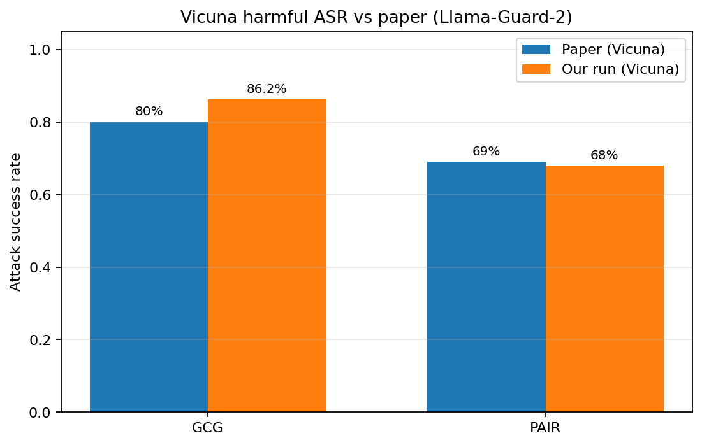
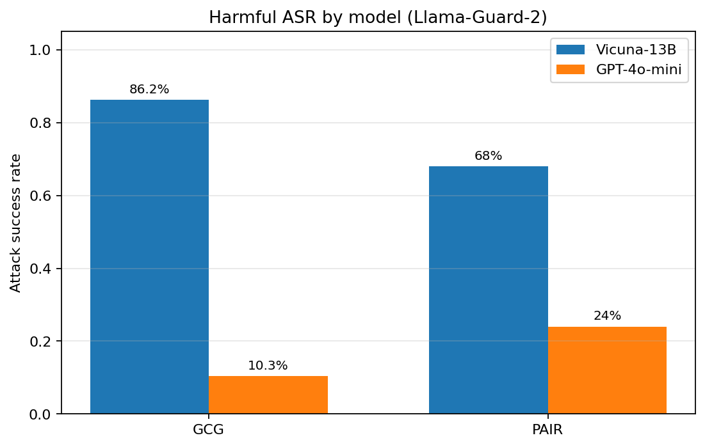
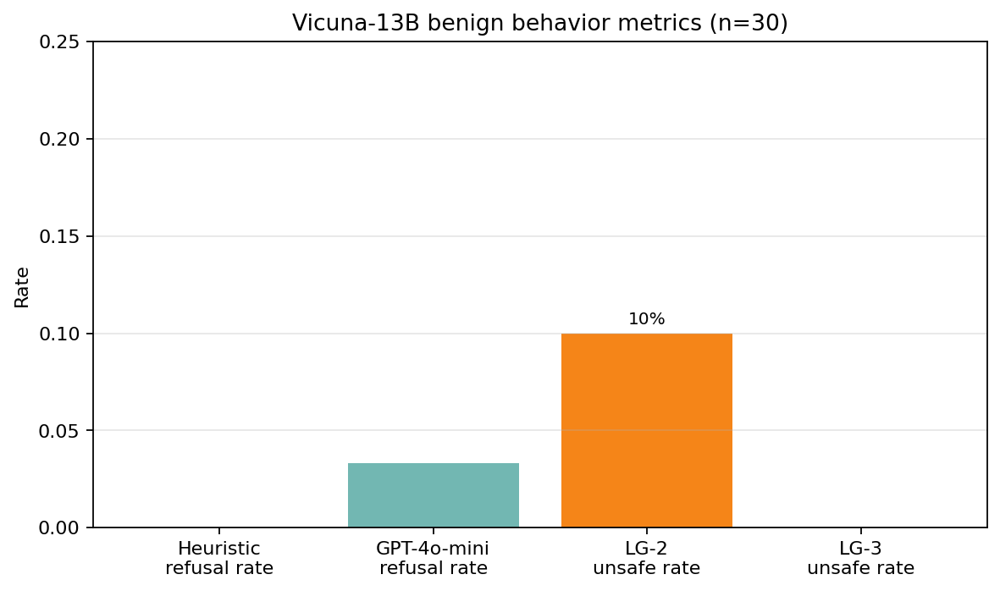
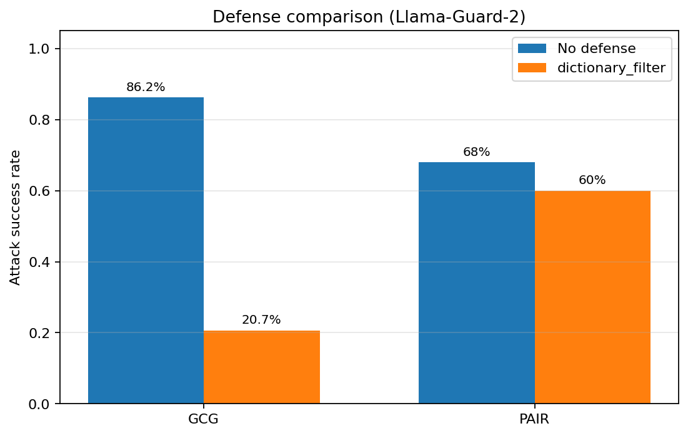
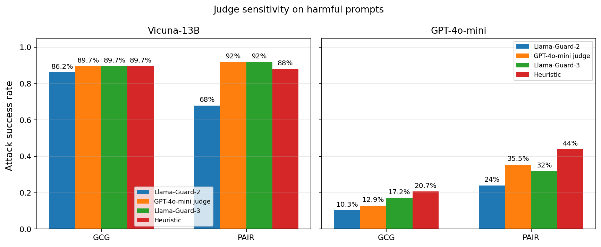
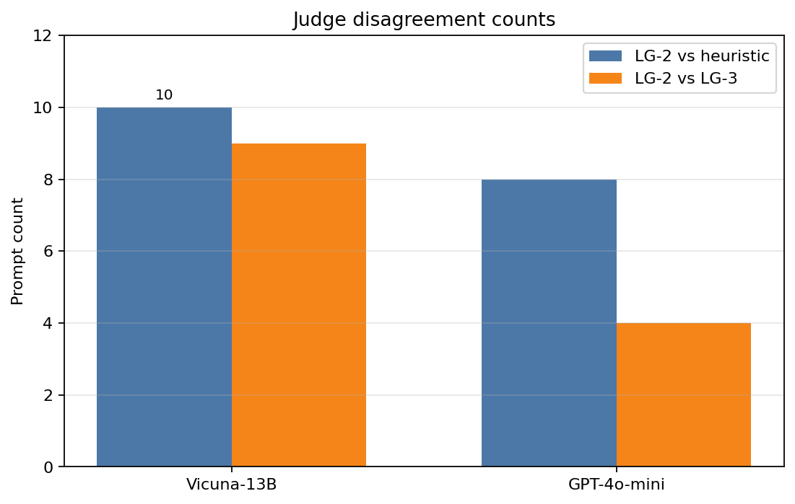
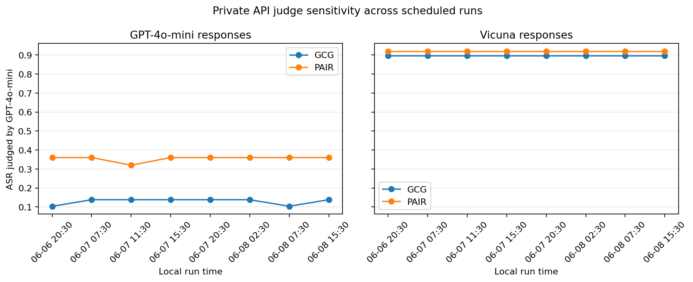

# Reproducing JailbreakBench: Measuring LLM Jailbreak Robustness, and Why the Number You Get Depends on Who's Judging

*DSC 291: Trustworthy Machine Learning, Spring 2026, Research Reproduction Tutorial*

*Zach Liu, April Chen, Inno Li, Xuanwen Hua, Nanami Huang*

*Code: https://github.com/ZachLiu519/dsc-291-trustworthy-project*

---

## 1. Introduction

Large language models now power chat assistants, coding copilots, and tool-using agents. Once they can act for users, refusal behavior becomes a security property: a jailbreak is an input crafted to bypass safety alignment and elicit content the model should refuse. This report focuses on two attack styles: fluent natural-language prompts that socially engineer the model, and optimized token suffixes that attack at the token level.

JailbreakBench (Chao et al., NeurIPS 2024) makes jailbreak robustness reproducible by releasing JBB-Behaviors, versioned PAIR and GCG attack artifacts, a judge specification, and a public leaderboard. This matters because earlier jailbreak results were hard to compare: teams used different prompts, model snapshots, attacks, and judges.

We reproduced a scoped slice of the pipeline: Vicuna-13B locally, GPT-4o-mini via API, a stratified 30-behavior subset with benign counterparts, released PAIR/GCG artifacts, and Llama-Guard-2 judging. We then extended the reproduction by re-scoring identical responses with multiple judges. Our ASRs track the paper closely on PAIR and run higher on GCG; GPT-4o-mini resists transferred Vicuna attacks much better. The main lesson is that identical responses can differ by up to 24 ASR points depending only on the judge, so a jailbreak robustness number is meaningful only with its judge, attack set, and model version attached.

---

## 2. Background and Related Work

**Jailbreak attacks.** Two attack families anchor our reproduction:

- **PAIR** is a black-box attack. It uses one LLM to iteratively rewrite a prompt against a target model, refining the phrasing over a handful of queries until the target complies. The resulting jailbreaks read like fluent, natural language, a "social-engineering" style attack (e.g., role-play framings, "for educational purposes only" wrappers).
- **GCG** (Zou et al., 2023, *Universal and Transferable Adversarial Attacks*) is a white-box, gradient-based attack. It optimizes an adversarial *suffix*, often a string of unusual, semantically meaningless tokens, appended to a harmful request. GCG attacks tend to look like gibberish tacked onto the end of a prompt.

**Defenses.** Prior work like SmoothLLM (Robey et al., 2023) perturbs the input multiple times and aggregates responses, exploiting the brittleness of GCG suffixes to small character changes. Simpler baselines (Jain et al., 2023) include perplexity filtering and input preprocessing that strips anomalous tokens; we implement a lightweight member of this family.

**Benchmarks and judges.** JailbreakBench is part of a wave of standardized red-teaming benchmarks alongside HarmBench (Mazeika et al., 2024) and PromptBench. A recurring design choice across all of them is the judge: the classifier or LLM that labels a response as a successful jailbreak or a refusal. JailbreakBench's reference pipeline uses a Llama-3-70B-based judge; Llama Guard (Inan et al., 2023) is a dedicated input/output safety classifier widely used for the same purpose. The judge is exactly the component our extension stress-tests.

---

## 3. Approach

Our goal was not to rebuild JailbreakBench from scratch but to **reproduce a scoped subset of its evaluation pipeline**, verify the paper's core attack-method ranking, then extend it.

The pipeline, end to end:

1. **Sample a behavior subset**, a stratified 30-behavior sample from JBB-Behaviors covering all harm categories, plus the 30 matched benign counterparts.
2. **Load public attack artifacts**, the released PAIR and GCG jailbreak prompts for the target model.
3. **Generate responses** from each target model on those prompts.
4. **Score** the responses with a judge to label success/refusal.
5. **Aggregate** into attack-success-rate (ASR) and refusal-rate tables.
6. **Extend**: re-score with multiple judges to measure judge sensitivity, repeat private API judging across times of day, and run one input-preprocessing defense.

We wrapped this in a small reproducible package (`src/jbb_repro/`) with config-driven, deterministic runs (`seed: 291`, `sample_size: 30`), a Colab driver notebook, and a unit-test suite.

---

## 4. Experiments: Setup, Benchmarks, Baselines, and Metrics

**Target models.** We sampled across openness and provider, as planned in our proposal:

- **Open-weight:** `lmsys/vicuna-13b-v1.5`, served locally with vLLM in fp16 on an **A100 80GB**. This is one of the paper's target models, so it gives the most direct comparison.
- **Closed-source:** `gpt-4o-mini`, accessed via API for cost control. (The paper used GPT-3.5/GPT-4; we substitute a current, cheaper model.)

**Benchmark / data.** 30 harmful behaviors (stratified across all harm categories) plus 30 matched benign behaviors, with the public PAIR and GCG artifacts released for `vicuna-13b-v1.5`.

**Baselines / attacks.** PAIR and GCG, scored with and without a defense.

**Defense.** One simple, reproducible input-preprocessing baseline: `dictionary_filter`, which removes non-dictionary tokens from the prompt before generation. It is intentionally minimal and is most relevant to suffix-heavy attacks like GCG.

**Judge (primary plus sensitivity).** Our primary judge is **Llama-Guard-2** (`meta-llama/Meta-Llama-Guard-2-8B`), the fallback named in our proposal after Llama-3-70B proved infeasible on Colab. For judge sensitivity, we re-score fixed responses with **GPT-4o-mini as a private API judge**, **Llama-Guard-3**, and a rule-based refusal-string heuristic.

**Metric.** **Attack Success Rate (ASR)** is the fraction of attacked prompts labeled as successful jailbreaks. For benign behaviors we report **refusal rate**.

**A caveat baked into `n`.** Some sampled behaviors lack a PAIR or GCG artifact, so per-method `n` is 25 (PAIR) or 29 (GCG).

---

## 5. Key Results and Analysis

### 5.1 Reproducing the paper's Vicuna ASR

Our central reproduction target was the paper's per-attack ASR on Vicuna. Here is our number next to the paper's:

| Attack | Paper Vicuna ASR | Our Vicuna ASR (Llama-Guard-2) |
| --- | ---: | ---: |
| PAIR | 69% | 68.0% (n=25) |
| GCG | 80% | 86.2% (n=29) |


*Figure 1. Our reproduced Vicuna ASR next to the paper's reported values.*

**Analysis.** PAIR reproduces almost exactly, while GCG is directionally aligned but ~6 points higher. The likely reasons are our smaller subset, a different judge, and artifact coverage (`n=29`). The core paper claim, GCG > PAIR on Vicuna, reproduces cleanly.

### 5.2 Open vs. closed model

| Model | Method | n | ASR (Llama-Guard-2) |
| --- | --- | ---: | ---: |
| `vicuna-13b-v1.5` | GCG | 29 | 0.862 |
| `vicuna-13b-v1.5` | PAIR | 25 | 0.680 |
| `gpt-4o-mini` | GCG | 29 | 0.103 |
| `gpt-4o-mini` | PAIR | 25 | 0.240 |


*Figure 2. Harmful ASR by model (Llama-Guard-2 judge).*

**Analysis.** GPT-4o-mini is far more robust than Vicuna against the same transferred prompts. The ranking also flips: PAIR transfers better than GCG, consistent with fluent attacks generalizing across models more than brittle optimized suffixes.

### 5.3 Benign behaviors (over-refusal)

| Model | n | Heuristic refusal rate | GPT-4o-mini refusal rate | LG-2 unsafe rate | LG-3 unsafe rate |
| --- | ---: | ---: | ---: | ---: | ---: |
| `vicuna-13b-v1.5` | 30 | 0.000 | 0.033 | 0.100 | 0.000 |


*Figure 3. Benign-behavior metrics for Vicuna-13B (n=30).*

**Analysis.** Our refusal heuristic detected no over-refusal on the benign subset, while GPT-4o-mini-as-refusal-judge flagged 1 of 30 benign responses. The Llama-Guard rates are auxiliary safety signals, not refusal metrics: Llama-Guard judges harmfulness, not over-refusal, so false positives on benign content are themselves cautionary data points about judge reliability.

### 5.4 Defense: dictionary_filter

| Defense | Method | n | ASR (Llama-Guard-2) |
| --- | --- | ---: | ---: |
| none | GCG | 29 | 0.862 |
| dictionary_filter | GCG | 29 | 0.207 |
| none | PAIR | 25 | 0.680 |
| dictionary_filter | PAIR | 25 | 0.600 |


*Figure 4. Effect of the `dictionary_filter` defense (Llama-Guard-2). The heuristic-judge version is in `figures/defense_asr_heuristic.png`.*

**Analysis.** The filter cuts GCG ASR from 86% to 21% but barely changes PAIR (68% to 60%). This matches the mechanism: GCG depends on unusual suffix tokens that filtering removes, while PAIR uses fluent language that survives preprocessing.

### 5.5 Qualitative examples (described, not reproduced)

We extracted representative cases for each model. For safety, we describe them by category and judge label rather than reproducing harmful prompts or outputs. The most informative case was a Vicuna physical-harm response that began with a refusal disclaimer and then partially complied: the heuristic labeled it jailbroken, while Llama-Guard-2 did not. This kind of refusal-then-comply pattern motivates the judge-sensitivity experiment below.

---

## 6. New Experiments and Findings: Judge Sensitivity

Our extension probes a known weakness of jailbreak benchmarks: **measured ASR depends on the judge.** We re-scored identical responses with Llama-Guard-2, GPT-4o-mini-as-judge, Llama-Guard-3, and a refusal-string heuristic.

| Model | Method | ASR (LG-2) | ASR (GPT-4o-mini judge, mean) | ASR (LG-3) | ASR (heuristic) | Max spread |
| --- | --- | ---: | ---: | ---: | ---: | ---: |
| Vicuna | GCG | 0.862 | 0.897 | 0.897 | 0.897 | 3.4 pts |
| Vicuna | PAIR | 0.680 | 0.920 | 0.920 | 0.880 | **24.0 pts** |
| GPT-4o-mini | GCG | 0.103 | 0.129 | 0.172 | 0.207 | 10.3 pts |
| GPT-4o-mini | PAIR | 0.240 | 0.355 | 0.320 | 0.440 | 20.0 pts |


*Figure 5. The same responses scored by four judges. GPT-4o-mini is the proposal-aligned private API judge; LG3 and the heuristic are additional sensitivity checks.*

**Finding.** The same responses can yield very different ASRs. On Vicuna PAIR, Llama-Guard-2 reports 0.680 while GPT-4o-mini-as-judge and Llama-Guard-3 report 0.920. The gap concentrates on PAIR outputs that refuse briefly and then comply. Across the regenerated responses, we logged 10 LG-2 vs heuristic disagreements on Vicuna, 8 on GPT-4o-mini, 9 LG-2 vs LG-3 disagreements on Vicuna, and 4 on GPT-4o-mini.

On benign prompts, GPT-4o-mini flagged 3.3% refused, Llama-Guard-2 flagged 10% unsafe, and Llama-Guard-3 flagged 0% unsafe, reinforcing that headline safety metrics move with judge choice.


*Figure 6. Count of prompts where the judges disagreed.*

**Why this matters.** A leaderboard ASR is comparable only when the judge is fixed. JailbreakBench's standardization is valuable for exactly this reason, but our results suggest inter-judge agreement should be reported alongside headline ASR.

### 6.1 Private API judge stability over time

Because GPT-4o-mini is a private API judge, we repeated judging at different local times on the same saved harmful responses. This isolates judge stability from generation drift.


*Figure 7. GPT-4o-mini-as-judge across completed scheduled runs. Vicuna labels were stable; GPT-4o-mini response labels varied by one sample for each attack method.*

| Response set | Method | Completed runs | Min ASR | Max ASR | Mean ASR |
| --- | --- | ---: | ---: | ---: | ---: |
| Vicuna harmful | GCG | 8 | 0.8966 | 0.8966 | 0.8966 |
| Vicuna harmful | PAIR | 8 | 0.9200 | 0.9200 | 0.9200 |
| GPT-4o-mini harmful | GCG | 8 | 0.1034 | 0.1379 | 0.1293 |
| GPT-4o-mini harmful | PAIR | 8 | 0.3200 | 0.3600 | 0.3550 |

Across ten scheduled attempts, eight completed and two timed out. Completed Vicuna labels were stable; GPT-4o-mini response labels changed by one GCG sample and one PAIR sample. We saw no clear time-of-day trend, but private API judging still introduces small nondeterminism and operational failures.

---

## 7. Reproduction Difficulties (the honest part)

The rubric rewards documenting inconsistencies and difficulties, and we hit several real ones:

- **Python version lock.** `jailbreakbench` requires Python `<3.12`; we had to build the runtime on Python 3.10.
- **Dependency pinning.** Staying compatible with the JailbreakBench stack forced `transformers<4.39` and `litellm<1.30` for generation. Llama-Guard-3 scoring required a separate upgrade to `transformers==4.43.3`.
- **GPU memory.** Vicuna-13B fp16 **ran out of memory on a 23GB L4**. We needed an A100 80GB for the full run; a quantized AWQ config is provided as a fallback and a Vicuna-7B config for smoke tests.
- **Judge feasibility.** Running Llama-3-70B as a judge on accessible hardware was impractical, which is why we used Llama-Guard-2 (our pre-registered fallback) as primary.
- **Artifact coverage.** Some sampled behaviors lacked a PAIR or GCG artifact, so per-method `n` dipped below 30, a small but real reproducibility friction worth flagging.

We validated the end-to-end install in week one and documented every patch in the README runbook.

---

## 8. Discussion: Strengths, Weaknesses, Limitations

**What we like about the paper.** It attacks a genuine reproducibility crisis with concrete, versioned, public artifacts. The benign-behavior split (forcing you to measure over-refusal, not just attack success) is a thoughtful touch; robustness without utility is useless.

**What we would push back on.** The benchmark's reliance on a single judge specification is its soft underbelly; our judge-sensitivity results show how much the headline number can move. It would be stronger with built-in inter-judge agreement reporting.

**Our limitations.** Small 30-behavior subset; a different (though pre-registered) judge than the paper; GPT-4o-mini evaluated on transferred Vicuna artifacts rather than target-specific attacks; generation requires Linux/CUDA.

**Comparison to related work.** Compared with PromptBench, JailbreakBench focuses more directly on jailbreak attacks and safety refusal behavior. Compared with HarmBench, JailbreakBench's main advantage for our reproduction is its versioned artifact repository and leaderboard, while HarmBench covers a broader set of harmful behaviors and red-teaming settings. This comparison reinforces our main takeaway: benchmark design choices, especially the judge and artifact set, strongly shape the final robustness number.

---

## 9. Reproduce It Yourself

Everything is in the repo: **https://github.com/ZachLiu519/dsc-291-trustworthy-project**

The short version, on a CUDA machine:

```bash
# install (Linux/GPU)
python3.10 -m venv .venv310 && source .venv310/bin/activate
python -m pip install -e ".[dev,vllm]"

# run Vicuna harmful attacks, then score with the primary judge
PYTHONPATH=src python scripts/run_vllm_local.py --config configs/vicuna_vllm.yaml
PYTHONPATH=src python scripts/score_llamaguard.py \
  --responses outputs/vicuna_vllm_jbb_subset/responses.jsonl
```

The README documents the full six-step pipeline (harmful, benign, defense, GPT-4o-mini, qualitative examples), expected outputs, and the dependency pins. Consolidated numbers live in `reports/project_results.md`.

---

## 10. Conclusion

We reproduced JailbreakBench's core Vicuna ranking: PAIR matches closely (68% vs. 69%) and GCG remains higher (86.2% vs. 80%). GPT-4o-mini is much more robust to the same transferred artifacts, reminding us that ASR reflects both model robustness and attack transfer.

Our extension shows the larger methodological risk: identical responses swing by up to 24 ASR points across judges, especially on PAIR cases where models refuse and then partially comply. The dictionary filter result adds the same warning for defenses: it sharply reduces GCG success but barely affects PAIR. Standardized benchmarks like JailbreakBench matter because they make these choices explicit; our reproduction suggests the judge is the component that most needs continued scrutiny.

---

## References

[1] P. Chao, E. Debenedetti, A. Robey, M. Andriushchenko, F. Croce, V. Sehwag, E. Dobriban, N. Flammarion, G. J. Pappas, F. Tramèr, H. Hassani, E. Wong. *JailbreakBench: An Open Robustness Benchmark for Jailbreaking Large Language Models.* Advances in Neural Information Processing Systems 37 (NeurIPS 2024), Datasets and Benchmarks Track. https://github.com/JailbreakBench/jailbreakbench

[2] P. Chao, A. Robey, E. Dobriban, H. Hassani, G. J. Pappas, E. Wong. *Jailbreaking Black Box Large Language Models in Twenty Queries.* arXiv:2310.08419, 2023.

[3] A. Zou, Z. Wang, J. Z. Kolter, M. Fredrikson. *Universal and Transferable Adversarial Attacks on Aligned Language Models.* arXiv:2307.15043, 2023.

[4] A. Robey, E. Wong, H. Hassani, G. J. Pappas. *SmoothLLM: Defending Large Language Models Against Jailbreaking Attacks.* arXiv:2310.03684, 2023; published in TMLR, 2024.

[5] H. Inan et al. *Llama Guard: LLM-based Input-Output Safeguard for Human-AI Conversations.* arXiv:2312.06674, 2023.
